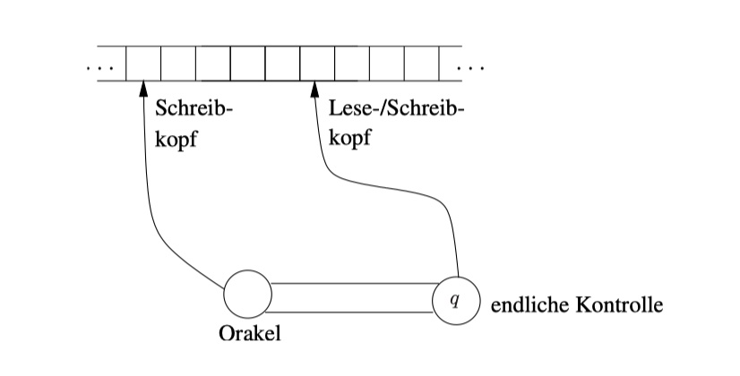

### Definition: Problem
Ein **Problem Π** ist gegeben durch:
+ eine allgemeine Beschreibung aller vorkommenden Parameter
+ eine genaue Beschreibung der Eigenschaften, die die Lösung haben soll
Ein **Problembeispiel /(Instanz)** von Π erhalten wir, indem wir die Parameter von Π festlegen.

### Definition: Kodierungsschema
+ Ein **Kodierungsschema** s ordnet jedem Problembeispiel eines Problems eine Zeichenkette oder Kodierung über einem Alphabet Σ zu.
+ Die **Inputlänge** eines Problembeispiels ist die Anzahl des Symbole seiner Kodierung.

Zwei Kodierungsschemata s1 , s2 heißen äquivalent bezüglich eines Problems Π, falls es Polynome p 1 , p 2 gibt, so dass gilt:
+ (|s1(/)|=n ⇒ |s2(/)|≤p2(n)) und (|s2(/)|=m ⇒ |s1(/)|≤p1(m))
für alle Problembeispiele / von Π.

### Definition: Zeitkomplexität
Für eine deterministische Turing-Maschine M, die für alle Eingaben über dem Eingabe-Alphabet Σ hält, ist die Zeitkomplexitätsfunktion T M : + → + definiert durch:
+ TM(n) = max(es gibt eine Eingabe x ∈ Σ mit |x | = n, so dass die Berechnung von M bei Eingabe x m Berechnungsschritte (Übergänge) benötigt, bis ein Endzustand erreicht wird)

### Definition: Die Klasse P
Die Klasse P ist die Menge aller Sprachen L (Probleme), für die eine deterministische Turing-Maschine existiert, deren Zeitkomplexitätsfunktion polynomial ist, d.h. es existiert ein Polynom p mit
+ T m(n) ≤ p(n).

## Die Nichtdeterministische Turingmaschine(NTM)
------------------

+ werden analog zur DTM durch das Oktupel (Q , Σ, t, Γ, s, δ, q J , q N ) beschrieben.
+ haben zusätzlich zu der endlichen Kontrolle mit dem Lese-/Schreibkopf ein Orakelmodul mit einem eigenen Schreibkopf.
+ NTMs haben genau zwei Endzustände qJ und qN , wobei qJ der akzeptierende Endzustand ist.
+ 非确定型图灵机和确定型图灵机的不同之处在于，在计算的每一时刻，根据当前状态和读写头所读的符号，机器存在多种状态转移方案，机器将任意地选择其中一种方案继续运作，直到最后停机为止

### Die Klasse NP
Die Klasse N P ist die Menge aller Sprachen L, für die es eine nichtdeterministische Turing-Maschine gibt, deren Zeitkomplexitätsfunktion polynomial beschränkt ist.
+ NP steht für nichtdeterministisch polynomial
+ Alle Sprachen in N P sind entscheidbar.
+ Informell ausgedrückt: Π gehört zu N P , falls Π folgende Eigenschaft hat:
  + Ist die Antwort bei Eingabe eines Beispiels / von Π Ja, dann kann die Korrektheit der Antwort in polynomialer Zeit überprüft werden